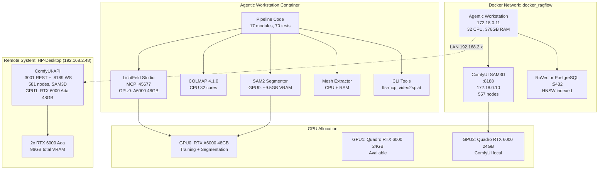

# Cluster Setup

## Infrastructure Diagram



## Resource Usage by Pipeline Stage

| Stage | Duration | Peak VRAM | Peak RAM | GPU Util | Primary Resource |
|-------|----------|-----------|----------|----------|-----------------|
| Frame Extraction | 5s | 0 MB | 200 MB | 0% | CPU (PyAV) |
| COLMAP Feature Extraction | 30s | ~1.5 GB | 2 GB | 80% | GPU (SIFT) |
| COLMAP Matching | 2 min | ~1.5 GB | 4 GB | 60% | GPU + CPU |
| COLMAP Sparse Recon | 15-20 min | ~1.5 GB | 1.1 GB | 2090% CPU | CPU (all cores) |
| COLMAP Undistortion | 10s | 0 MB | 500 MB | 0% | CPU + Disk I/O |
| 3DGS Training (7k iter) | 2m 15s | 8.4 GB | 30 GB | 99% @ 299W | GPU (CUDA kernels) |
| SAM2 Segmentation (13 frames) | 46s | 9.5 GB | 31 GB | 92% @ 246W | GPU (transformer) |
| Mesh Extraction | ~60s | 0 MB | ~8 GB | 0% | CPU + RAM |
| USD Assembly | <1s | 0 MB | 100 MB | 0% | CPU |

## Minimum Hardware Specification

Based on measured peak usage with 20% headroom:

| Component | Minimum | Recommended | Our Setup |
|-----------|---------|-------------|-----------|
| GPU VRAM | 12 GB | 24 GB | 48 GB (A6000) |
| System RAM | 36 GB | 64 GB | 376 GB |
| CPU Cores | 8 | 16 | 32 |
| Disk (SSD) | 50 GB free | 200 GB free | 408 GB free |
| GPU Compute | SM 7.5+ | SM 8.6+ | SM 8.6 |

## Network Topology

```
Host (192.168.2.48)
├── docker_ragflow bridge (172.18.0.0/16)
│   ├── agentic-workstation (172.18.0.11)
│   ├── comfyui-sam3d (172.18.0.10)
│   ├── ruvector-postgres (172.18.0.x)
│   └── other services...
└── LAN
    └── HP-Desktop (192.168.2.48)
        └── comfyui-api (:3001, :8189)
```
