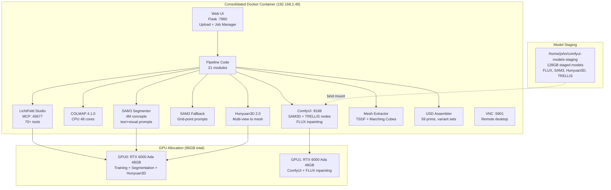

# Cluster Setup

## Consolidated Docker Architecture

The pipeline has been consolidated into a single Docker container running on a dedicated workstation with dual RTX 6000 Ada GPUs.

### Host Machine

| Component | Specification |
|-----------|--------------|
| CPU | AMD Threadripper PRO 48-core |
| RAM | 251 GB |
| GPU 0 | NVIDIA RTX 6000 Ada (48 GB VRAM) |
| GPU 1 | NVIDIA RTX 6000 Ada (48 GB VRAM) |
| Total VRAM | 96 GB |
| OS | Linux |
| Host IP | 192.168.2.48 |

### Exposed Ports

| Port | Service | Purpose |
|------|---------|---------|
| 7860 | Web UI (Flask) | Video upload, job management, pipeline control |
| 8188 | ComfyUI | SAM3D/TRELLIS nodes, FLUX inpainting workflows |
| 5901 | VNC | Remote desktop access |
| 45677 | LichtFeld MCP | 70+ JSON-RPC tools for agent control |

## Infrastructure Diagram



## VRAM Management Strategy

With 96GB total VRAM across two GPUs, the pipeline uses **stage-based model unloading** to avoid OOM:

| Pipeline Stage | GPU 0 (48GB) | GPU 1 (48GB) |
|---------------|--------------|--------------|
| COLMAP SfM | ~1.5 GB (SIFT) | idle |
| 3DGS Training | 8.4 GB (CUDA kernels) | idle |
| SAM2/SAM3 Segmentation | 9.5 GB (transformer) | idle |
| Mask Projection | CPU only | idle |
| Hunyuan3D 2.0 Mesh | ~20 GB (multi-view) | idle |
| FLUX Inpainting | idle | ~24 GB (FLUX model) |
| ComfyUI Workflows | idle | ~16 GB (SAM3D/TRELLIS) |
| TSDF Mesh Extraction | CPU + 3 GB RAM | idle |
| USD Assembly | CPU only | idle |

Models are loaded/unloaded per-stage. The 128GB model staging directory (`/home/john/comfyui-models-staging`) holds all checkpoints on fast SSD so loading is under 30 seconds per model.

## Resource Usage by Pipeline Stage

| Stage | Duration | Peak VRAM | Peak RAM | GPU Util | Primary Resource |
|-------|----------|-----------|----------|----------|-----------------|
| Frame Extraction | 5s | 0 MB | 200 MB | 0% | CPU (PyAV) |
| COLMAP Feature Extraction | 30s | ~1.5 GB | 2 GB | 80% | GPU (SIFT) |
| COLMAP Matching | 2 min | ~1.5 GB | 4 GB | 60% | GPU + CPU |
| COLMAP Sparse Recon | ~20 min | ~1.5 GB | 1.1 GB | 4800% CPU | CPU (48 cores) |
| COLMAP Undistortion | 10s | 0 MB | 500 MB | 0% | CPU + Disk I/O |
| 3DGS Training (7k iter) | 2m 15s | 8.4 GB | 30 GB | 99% @ 299W | GPU (CUDA kernels) |
| SAM2 Segmentation (13 frames) | 46s | 9.5 GB | 31 GB | 92% @ 246W | GPU (transformer) |
| SAM2 Segmentation (121 frames) | ~5 min | 9.5 GB | 31 GB | 92% | GPU (transformer) |
| Mask Projection to 3D | 7.3 min | 0 MB | ~4 GB | 0% | CPU (batch voting) |
| TSDF Mesh Extraction | 12 min | 0 MB | ~3 GB | 0% | CPU + RAM |
| Object Separation | variable | 0 MB | ~2 GB | 0% | CPU |
| USD Assembly | < 1 s | 0 MB | 100 MB | 0% | CPU |

## Model Staging Directory

```
/home/john/comfyui-models-staging/     (128GB total)
├── checkpoints/
│   ├── flux1-dev.safetensors
│   ├── flux1-schnell.safetensors
│   └── ...
├── sam3/
│   └── sam3_hiera_large.pt
├── hunyuan3d/
│   └── hunyuan3d_v2.safetensors
├── trellis/
│   └── ...
├── loras/
│   └── ...
└── controlnet/
    └── ...
```

## Minimum Hardware Specification

Based on measured peak usage with 20% headroom:

| Component | Minimum | Recommended | Our Setup |
|-----------|---------|-------------|-----------|
| GPU VRAM | 12 GB | 48 GB (1 GPU) | 96 GB (2x RTX 6000 Ada) |
| System RAM | 36 GB | 64 GB | 251 GB |
| CPU Cores | 8 | 32 | 48 (Threadripper PRO) |
| Disk (SSD) | 50 GB free | 200 GB free | 128 GB models + workspace |
| GPU Compute | SM 7.5+ (Turing) | SM 8.9+ (Ada) | SM 8.9 (Ada Lovelace) |
| CUDA | 11.8+ | 12.1+ | 12.4 |

### GPU Compatibility Notes

- **12 GB VRAM**: Can run the pipeline if SAM2 and training do not overlap. Use `CUDA_VISIBLE_DEVICES` to serialize.
- **24 GB VRAM**: Comfortable for single-object scenes. Multi-object with ComfyUI inpainting requires a second GPU or remote endpoint.
- **48 GB VRAM**: Full pipeline including training + segmentation + Hunyuan3D.
- **96 GB VRAM (dual GPU)**: Full concurrent pipeline. Training + segmentation on GPU 0, ComfyUI + FLUX on GPU 1.

## Network Topology

```
Consolidated Docker Container (192.168.2.48)
├── Web UI          :7860   (public, video upload + job manager)
├── ComfyUI         :8188   (SAM3D/TRELLIS workflows)
├── VNC             :5901   (remote desktop)
├── LichtFeld MCP   :45677  (agent control)
└── Internal
    ├── Pipeline modules (21 Python modules)
    ├── GPU 0: RTX 6000 Ada 48GB (training, segmentation, Hunyuan3D)
    └── GPU 1: RTX 6000 Ada 48GB (ComfyUI, FLUX inpainting)
```
