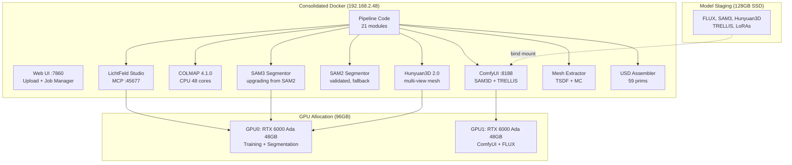

# Performance Statistics -- Video-to-USD Pipeline

## Test Environments

### Primary: Consolidated Docker on Dual RTX 6000 Ada
- **GPUs**: 2x NVIDIA RTX 6000 Ada (48 GB each, 96 GB total)
- **CPU**: AMD Threadripper PRO 48-core
- **RAM**: 251 GB
- **Host**: 192.168.2.48
- **Test asset**: Gallery tour video, 121 frames, ~1M Gaussians after 7k training iterations

### Legacy: Agentic Workstation Container
- **GPU**: RTX A6000 48 GB
- **CPU**: 32 cores
- **RAM**: 376 GB
- **Test asset**: 15-second video, 15 extracted frames, ~50k Gaussians

## Infrastructure Diagram

## Pipeline Timing Breakdown

| Stage | Duration | Notes |
|-------|----------|-------|
| Frame Extraction (PyAV) | ~5 s | CPU-only, 1 fps default |
| COLMAP Feature Extraction | ~30 s | GPU SIFT |
| COLMAP Exhaustive Matching | ~2 min | GPU + CPU |
| COLMAP Sparse Reconstruction | ~20 min | CPU-bound, 32-48 cores |
| COLMAP Image Undistortion | ~10 s | CPU + disk I/O |
| 3DGS Training (7k iterations) | 2 min 15 s | 1M gaussians, CUDA kernels, 99% GPU util |
| SAM2 Segmentation (13 frames) | ~46 s | Transformer inference |
| SAM2 Segmentation (121 frames) | ~5 min | Full gallery tour |
| Mask Projection to 3D | 7.3 min | CPU, per-Gaussian voting, 200K batches |
| Object Separation | variable | 33 objects extracted, 98.3% coverage |
| TSDF Mesh Extraction | 12 min | Open3D fusion, 22K verts / 49K faces |
| Mesh Cleaning (Trimesh) | ~10 s | CPU |
| USD Assembly | < 1 s | 59 prims, variant sets |
| **Total (end-to-end, gallery)** | **~50 min** | Including TSDF + full segmentation |
| **Total (end-to-end, minimal)** | **~22-25 min** | 15 frames, basic MC mesh |

## GPU VRAM Usage per Stage

| Stage | Allocated VRAM | Peak VRAM | GPU Power |
|-------|---------------|-----------|-----------|
| Frame Extraction | 0 MB | 0 MB | idle |
| COLMAP Feature Extraction | ~1.5 GB | ~1.5 GB | 80% util |
| COLMAP Matching | ~1.5 GB | ~1.5 GB | 60% util |
| COLMAP Sparse Recon | ~1.5 GB | ~1.5 GB | CPU-bound |
| COLMAP Undistortion | 0 MB | 0 MB | idle |
| 3DGS Training (7k iter, 1M gaussians) | 8.4 GB | 8.4 GB | 99% util @ 299 W |
| SAM2 Segmentation | 9.5 GB | 9.5 GB | 92% util @ 246 W |
| Mask Projection | 0 MB | 0 MB | CPU only |
| TSDF Mesh Extraction | 0 MB | ~3 GB RAM | CPU only |
| USD Assembly | 0 MB | 0 MB | idle |

**Peak GPU VRAM**: 9.5 GB (SAM2 segmentation stage)

## Object Separation Results

| Metric | Value |
|--------|-------|
| Total Gaussians (after outlier filter) | 950,000 |
| Labeled Gaussians | 933,837 (98.3%) |
| Unlabeled Gaussians | 16,163 |
| Objects extracted (>= 10 Gaussians) | 33 |
| Dominant object (room/walls) | 661,548 Gaussians (69.6%) |
| Second largest | 107,438 Gaussians (11.3%) |
| Third largest | 57,291 Gaussians (6.0%) |

## TSDF Mesh Results

| Metric | Value |
|--------|-------|
| Vertices | 22,000 |
| Faces | 49,000 |
| Extraction time | 12 min |
| RAM usage | ~3 GB |
| Method | Open3D TSDF fusion |

## USD Scene Results

| Metric | Value |
|--------|-------|
| Total prims | 59 |
| Variant sets | Gaussian + Mesh per object |
| Assembly time | < 1 s |

## System RAM Usage per Stage

| Stage | Peak RAM | Notes |
|-------|----------|-------|
| Frame Extraction | ~200 MB | PyAV decoder |
| COLMAP (all phases) | ~4 GB | Feature DB + matching |
| 3DGS Training | ~30 GB | Point cloud + SH coefficients |
| SAM2 Segmentation | ~31 GB | Model weights + frame buffers |
| Mask Projection | ~4 GB | Batch voting arrays |
| TSDF Mesh Extraction | ~3 GB | Voxel grid + fusion |
| Mesh Extraction (MC) | ~8 GB | Voxel grid + marching cubes |
| USD Assembly | ~100 MB | Scene graph serialization |

**Peak system RAM**: ~31 GB (SAM2 segmentation, co-resident with training data)

## Disk Usage for Intermediate Artifacts

| Artifact | Size | Path |
|----------|------|------|
| Extracted frames (15 frames) | ~45 MB | `<project>/frames/` |
| Extracted frames (121 frames) | ~360 MB | `<project>/frames/` |
| COLMAP sparse model | ~5 MB | `<project>/colmap/sparse/` |
| COLMAP undistorted images | ~90 MB | `<project>/colmap/undistorted/` |
| 3DGS checkpoint (7k iter) | ~50 MB | `<project>/output/point_cloud/` |
| SAM2 masks (per frame) | ~2-20 MB | `<project>/masks/` |
| Per-object PLY files (33 objects) | ~200 MB | `<project>/objects/` |
| TSDF mesh | ~5 MB | `<project>/meshes/` |
| Final USD scene | ~20-100 MB | `<project>/scene.usda` |
| **Total per project (gallery)** | **~800 MB** | |
| **Total per project (minimal)** | **~220-440 MB** | |

## Minimum / Recommended Hardware Specifications

Based on measured peak usage with 20% headroom.

| Component | Minimum | Recommended | Consolidated Docker |
|-----------|---------|-------------|---------------------|
| GPU VRAM | 12 GB | 24 GB | 96 GB (2x RTX 6000 Ada) |
| System RAM | 36 GB | 64 GB | 251 GB |
| CPU Cores | 8 | 16 | 48 (Threadripper PRO) |
| Disk (SSD) | 50 GB free | 200 GB free | 128 GB models + workspace |
| GPU Compute | SM 7.5+ (Turing) | SM 8.6+ (Ampere) | SM 8.9 (Ada Lovelace) |
| CUDA | 11.8+ | 12.1+ | 12.4 |

### GPU Compatibility Notes

- **12 GB VRAM**: Can run the pipeline if SAM2 and training do not overlap. Use `CUDA_VISIBLE_DEVICES` to serialize.
- **24 GB VRAM**: Comfortable for single-object scenes. Multi-object with ComfyUI inpainting requires a second GPU or remote endpoint.
- **48 GB+ VRAM**: Full concurrent pipeline including training + segmentation overlap.
- **96 GB (dual GPU)**: Full pipeline with concurrent FLUX inpainting on second GPU.

### Dual RTX 6000 Ada Target Specs

| Feature | Value |
|---------|-------|
| Architecture | Ada Lovelace (SM 8.9) |
| VRAM per GPU | 48 GB GDDR6 ECC |
| Memory bandwidth | 960 GB/s per GPU |
| CUDA cores | 18,176 per GPU |
| RT cores | 142 per GPU |
| TDP | 300W per GPU |
| Total VRAM | 96 GB |
| NVLink | Not available (PCIe only) |

### Multi-GPU Configuration

| GPU | Role | VRAM Required |
|-----|------|---------------|
| GPU 0 | Training + SAM2/SAM3 + Hunyuan3D | 12 GB min, 48 GB recommended |
| GPU 1 | ComfyUI + FLUX inpainting | 24 GB min for FLUX models |
